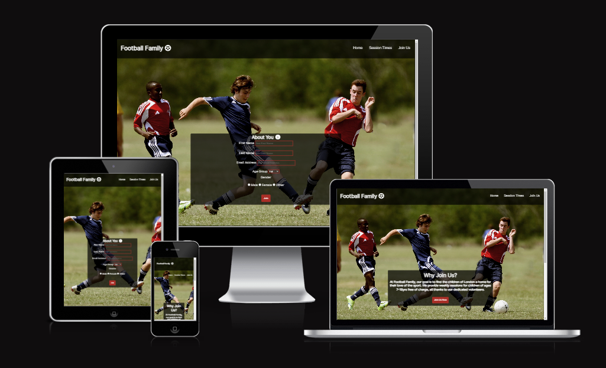
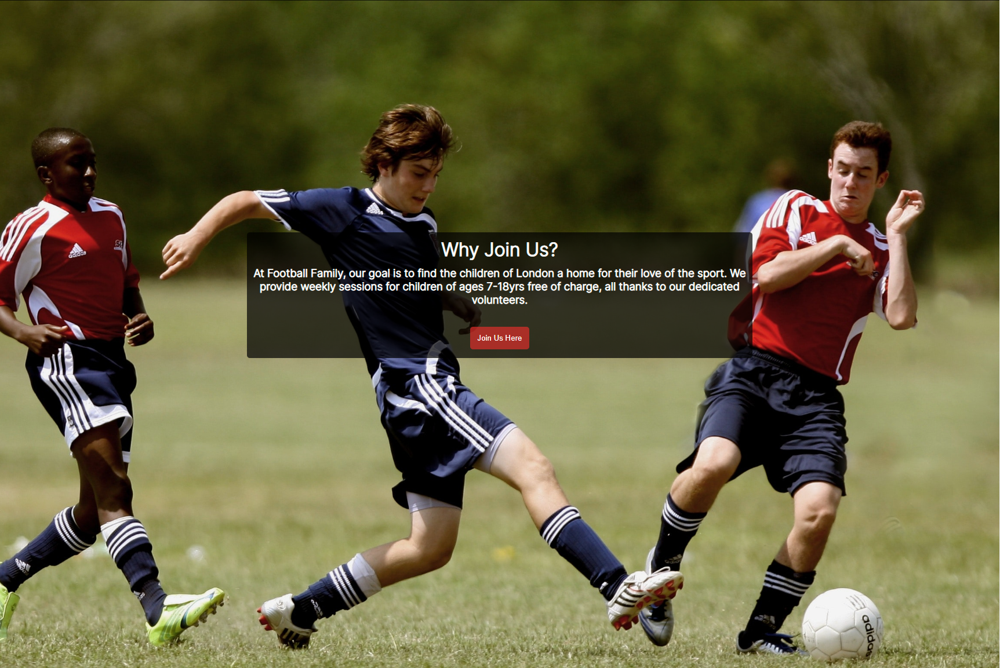

# Football Family
The Football Family website aims to help the children of London find cost free football training sessions. Football Family aims to be the home for football enthusastic children of ages 7 to 18 and help them nurture their talents and skills.

All users of the website will be able to locate all of the the basic information that they need to know to get started via the introductury message on the home page, the session times, socail media links and a sign up form.

## Features

- __Navigation Bar__

    - It is identical on each page, providing users an easy way to reach navigate their way around the website.
    - The scetion indclues the Logo which when clicked takes you to the home page, a further Home page link, a link to the Sessions Times on the home page and a Join Us page. As a result, the user should have no reason to use the 'back button' on their chosen browser.

- __Home Page Image and Greeting Information__

    - The home page presents a photograph of one of the 11-18's sessions to the user, giving them a small insight into what Football Family is all about.
    - Placed infront of this image is a text overlay which presents the objective and applicable age groups of Footbal Family's service. Within this, there is also a button marked 'Join Us Here' which takes the user to the Join Us page on the website, without having to use the relevant section of the Navigation bar.

- __Session Times Section__

    - This section allows the user to find out the day, start and end time and age group of the session taking place. With its simple design, the user can easily find the information that applies to them.
    - If a session is to be cancelled or the time changes due to adverse weather conditions or lack of staff availability, this section will be updated accordingly.

- __Footer__

    - The footer section includes links to Football Familys Twitter, Instagram and YouTube social media pages. When clicked, the link will open in a new tab for a better user experience.
    - The footer is also featured on each page of the website and allows the user to find images and information about Football Family that is not seen on the website.

