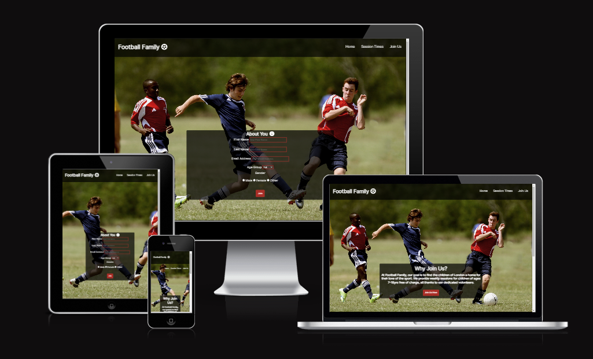
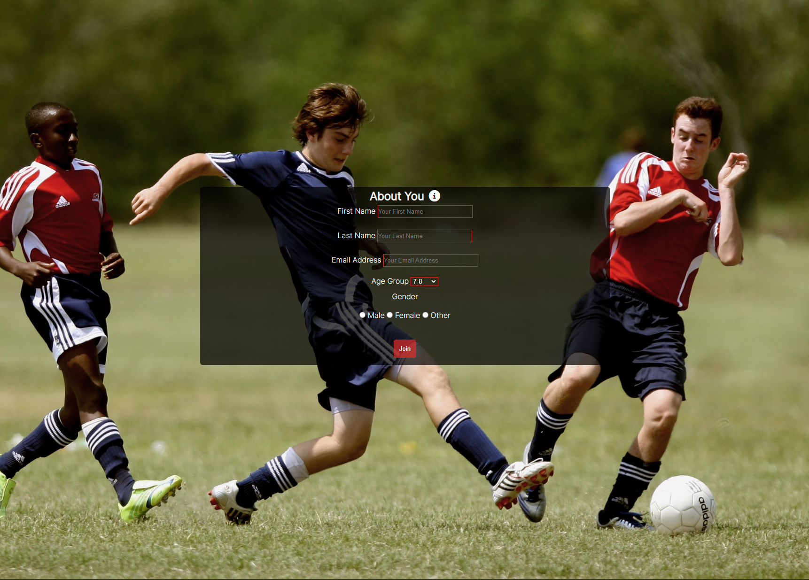
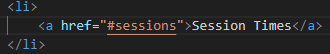
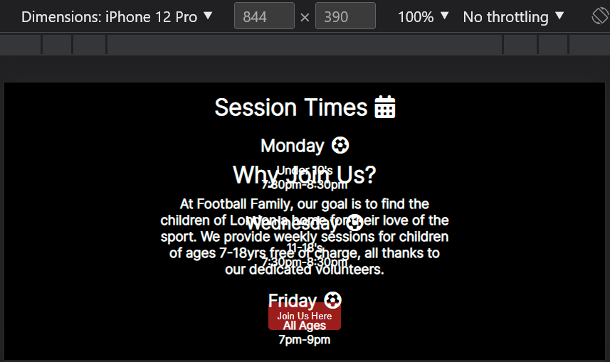
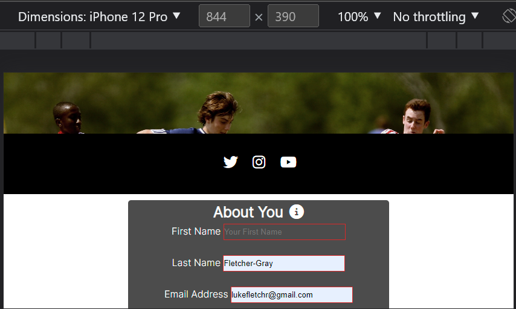
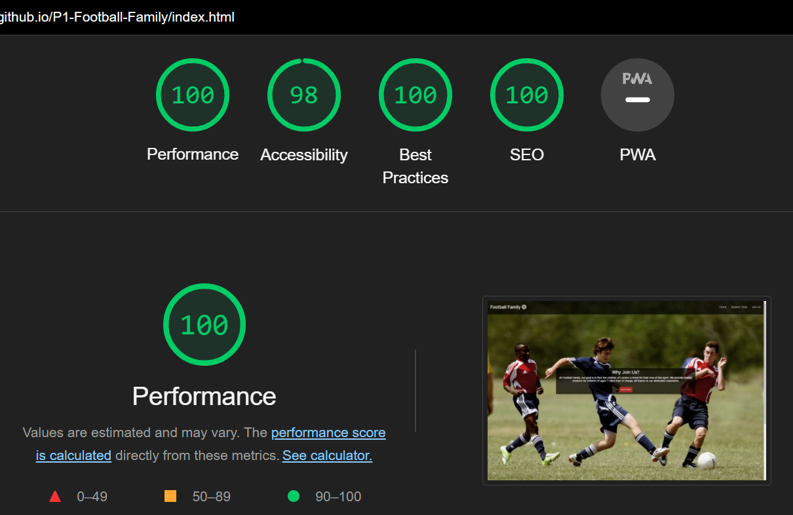

# Football Family
The Football Family website aims to help the children of London find cost free football training sessions. Football Family aims to be the home for football enthusastic children of ages 7 to 18 and help them nurture their talents and skills.

All users of the website will be able to locate all of the basic information that they need to know to get started via the introductury message on the home page, the session times, socail media links and a sign up form.

## Features

- __Navigation Bar__

    - It is identical on each page, providing users an easy way to reach navigate their way around the website.
    - The section indclues the Logo which when clicked takes you to the home page, a further Home page link, a link to the Sessions Times on the home page and a Join Us page. As a result, the user should have no reason to use the 'back button' on their chosen browser.

- __Home Page Image and Greeting Information__

    - The home page presents a photograph of one of the 11-18's sessions to the user, giving them a small insight into what Football Family is all about.
    - Placed in front of this image is a text overlay which presents the objective and applicable age groups of Footbal Family's service. Within this, there is also a button marked 'Join Us Here' which takes the user to the Join Us page on the website, without having to use the relevant section of the Navigation bar.

- __Session Times Section__

    - This section allows the user to find out the day, start and end time and age group of the session taking place. With its simple design, the user can easily find the information that applies to them.
    - If a session is to be cancelled or the time changes due to adverse weather conditions or lack of staff availability, this section will be updated accordingly.

- __Footer__

    - The footer section includes links to Football Familys Twitter, Instagram and YouTube social media pages. When clicked, the link will open in a new tab for a better user experience.
    - The footer is also featured on each page of the website and allows the user to find images and information about Football Family that is not seen on the website.
    - In future, contact information will be a great addition for the user to be able to find easily should they have and queries.

- __Join Us Page__

    - This page allows the user to sign up to the sessions provided and join Football Family. The user is asked to provide their full name and email address, which will be used as a means of contact for Football Family. They are also asked to select their age group and gender so that they are entered into the correct sessions.

## Testing

- I have tested that the website runs correctly on different browsers such as Chrome, Safari and Firefox
- I have confirmed that the website is responsive, maintains a clean structure and functions across most screen sizes. Screen sizes include desktops, tablets and modern smartphones. This was achieved by using the developer tools in Google Chrome.
- I confirmed that the Logo, Navigation Bar, Greeting information, Session Times and Join Us form text is visable and easy to read.
- I confirmed that all of the links to social media pages open and in a new tab.
- I have tested and confirmed that the form works, requires an entry in each field, list and button. For the email entry, the form will not submit unless a valid email is entered.

## Fixed Bugs

- When I created the session times section and created a link to the section in the nav, I discovered that the link did not work.
- I found that the reason for this was because I had not entered a # before the class name 'Sessions'.

- This was fixed by adding # before the class name.

# Unfixed Bugs

- __The First bug__

    - Although the website is responsive across a multitude of display sizes, I have faced a problem on mobile phone screens when they are rotated horizontally. 
    - The information displayed on the home page and on the join us form overlaps the footer and becomes unreadable and does not look good.

- __The Second Bug__

    - Another issue I have come across is with the page that is loaded after the data from the form is submitted. I am aware that there needs to be a 'http' within the action of the form element which is where the data is stored, however, I am unsure on how to create this. The page that is displayed once the form is completed can be seen below.
    

## Validator Testing

- __HTML__
    - No errors where returned when using the W3 validator
    - The following warning was returned: Consider using the h1 element as a top-level heading only (all h1 elements are treated as top-level headings by many screen readers and other tools).

- __CSS__
    - No errors or warnings where returned when using the W3C CSS validator

- __Accessability__
    - I confirmed that the choice of colours and fonts are easy to read and accessible by running the code through liqghthouse in the Developer tools in Chrome.
    

## Deployment

- __The site was deployed via GitHub Pages. To do this youself you will need to:__
    - Select the settings tab within the GitHub repository.
    - Under the Code and automation section, select pages.
    - Within the branch drop-dwon, select the 'main' branch and ensure that the /(root) folder is selected and press save.
    - Once all of the above are completed, a link to the completed website was provided at the top of the page.
    Here is the link: https://1ukefg.github.io/P1-Football-Family/

## Credits

- __Content__
    - I have used the code structure from the Code Institutes Love Running sample project for the socail media links in the footer

- __Media__
    - The icons that are feature across the website are take from https://fontawesome.com/
    - The background image that is featured on all of the pages on the website was taken from https://www.pexels.com/
